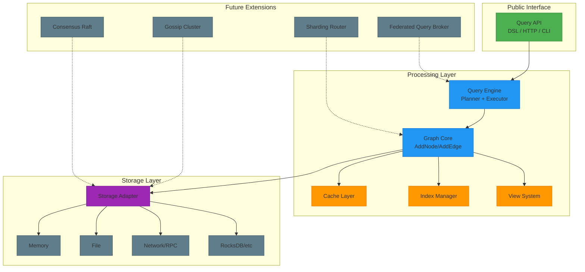

# Architecture

```mermaid
graph TD
    subgraph "Public Interface"
        A[Query API <br>DSL / HTTP / CLI]
    end

    subgraph "Processing Layer"
        B[Query Engine<br>Planner + Executor]
        C[Graph Core<br>AddNode/AddEdge]
        D[Cache Layer]
        E[Index Manager]
        F[View System]
    end

    subgraph "Storage Layer"
        G[Storage Adapter]
        H[Memory]
        I[File]
        J[Network/RPC]
        K[RocksDB/etc]
    end

    subgraph "Future Extensions"
        L[Sharding Router]
        M[Federated Query Broker]
        N[Gossip Cluster]
        O[Consensus Raft]
    end

    A --> B
    B --> C
    C --> D
    C --> E
    C --> F
    C --> G
    G --> H
    G --> I
    G --> J
    G --> K

    style A fill:#4CAF50,stroke:#388E3C
    style B fill:#2196F3,stroke:#1976D2
    style C fill:#2196F3,stroke:#1976D2
    style D fill:#FF9800,stroke:#F57C00
    style E fill:#FF9800,stroke:#F57C00
    style F fill:#FF9800,stroke:#F57C00
    style G fill:#9C27B0,stroke:#7B1FA2
    style H fill:#607D8B,stroke:#455A64
    style I fill:#607D8B,stroke:#455A64
    style J fill:#607D8B,stroke:#455A64
    style K fill:#607D8B,stroke:#455A64

    L -.-> C
    M -.-> B
    N -.-> G
    O -.-> G

    classDef primary fill:#4CAF50,stroke:#388E3C,font-size:14px;
    classDef secondary fill:#2196F3,stroke:#1976D2,font-size:14px;
    classDef cache fill:#FF9800,stroke:#F57C00,font-size:14px;
    classDef storage fill:#9C27B0,stroke:#7B1FA2,font-size:14px;
    classDef ext fill:#607D8B,stroke:#455A64,font-size:14px;

    class A primary
    class B,C secondary
    class D,E,F cache
    class G storage
    class H,I,J,K,L,M,N,O ext

    click A "https://example.com/api" "Query API"
    click C "https://example.com/core" "Graph Core"
    click G "https://example.com/storage" "Storage Abstraction"
```