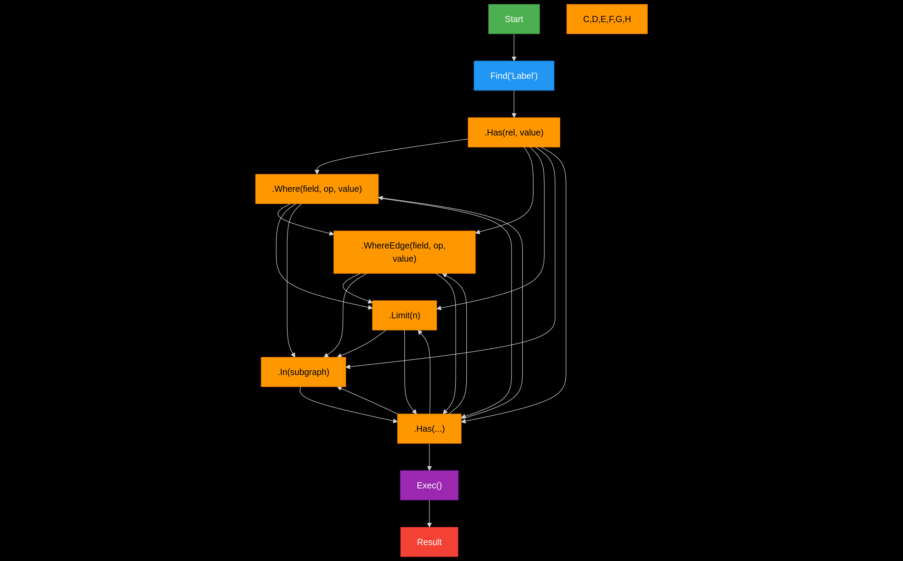

# KnitKnot DSL Syntax

## Syntax Diagram
TODO: Use railroad diagram


## BNF Syntax
TODO
```bnf
Query       = FindMethod { ChainableMethod } "Exec()" ;
FindMethod  = "Find(" String ")" ;
ChainableMethod = HasMethod
                | WhereMethod
                | WhereEdgeMethod
                | LimitMethod
                | InMethod ;
HasMethod   = ".Has(" String "," String ")" ;
WhereMethod = ".Where(" String "," String "," Value ")" ;
WhereEdgeMethod = ".WhereEdge(" String "," String "," Value ")" ;
LimitMethod = ".Limit(" Number ")" ;
InMethod    = ".In(" String ")" ;

String      = "'" <any char except '> "'".
Number      = digit+
Value       = String | Number
```

## Example
TODO